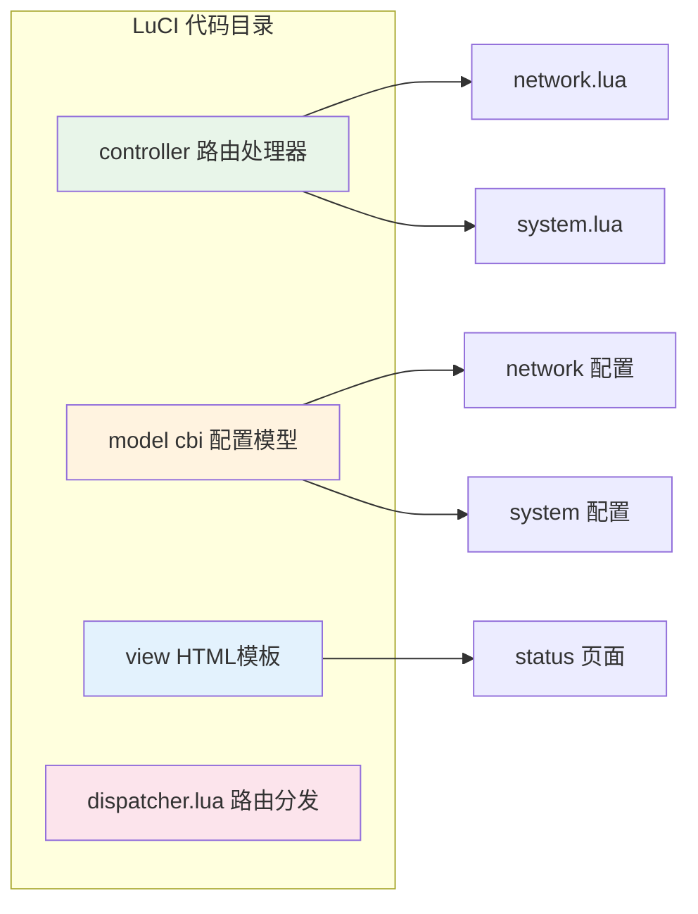
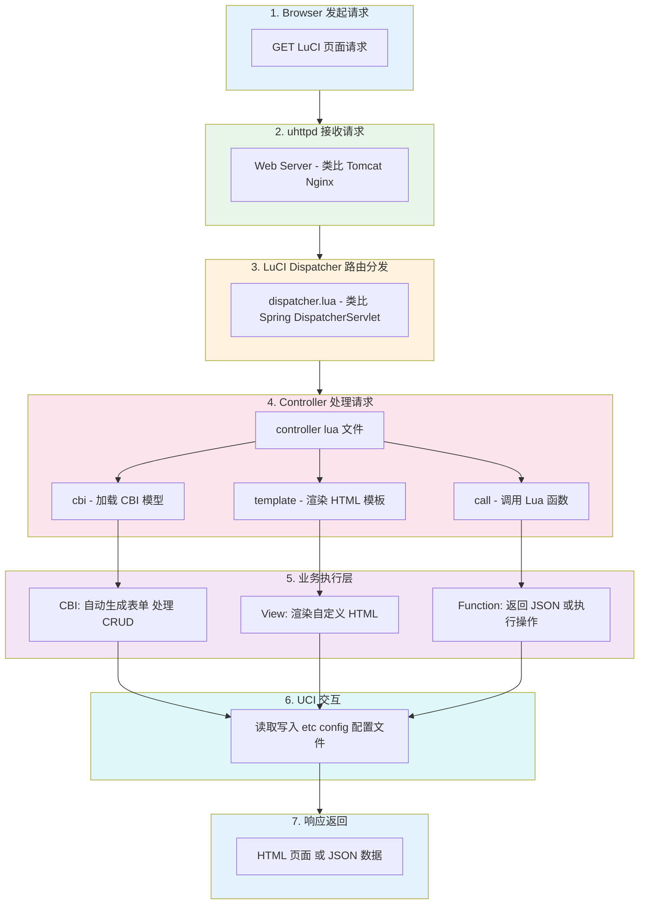
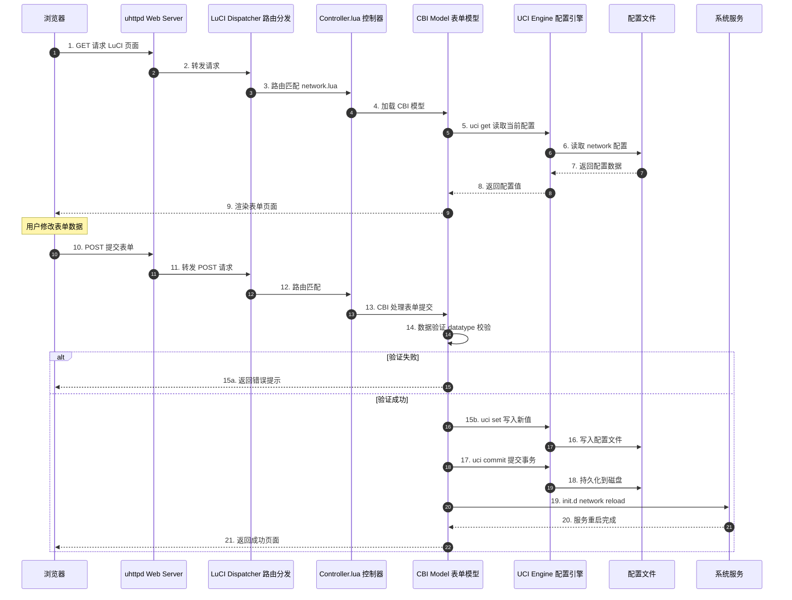
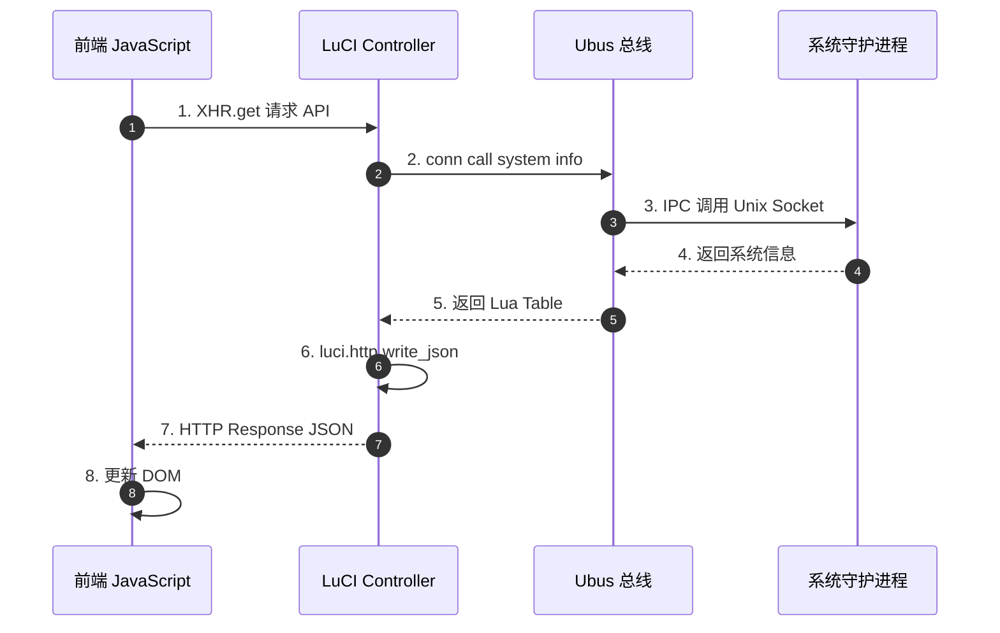
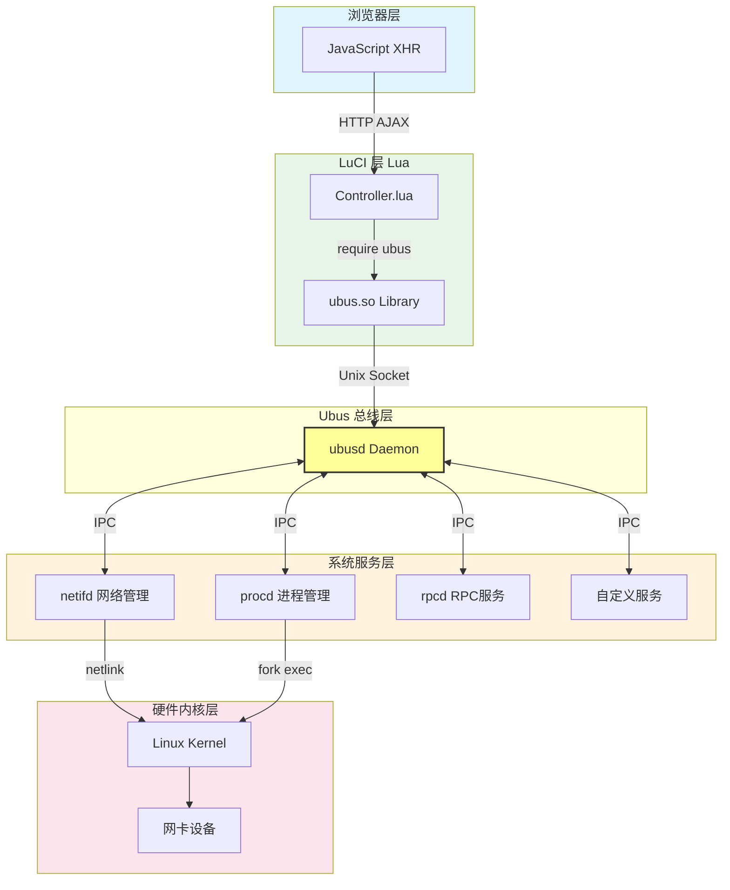
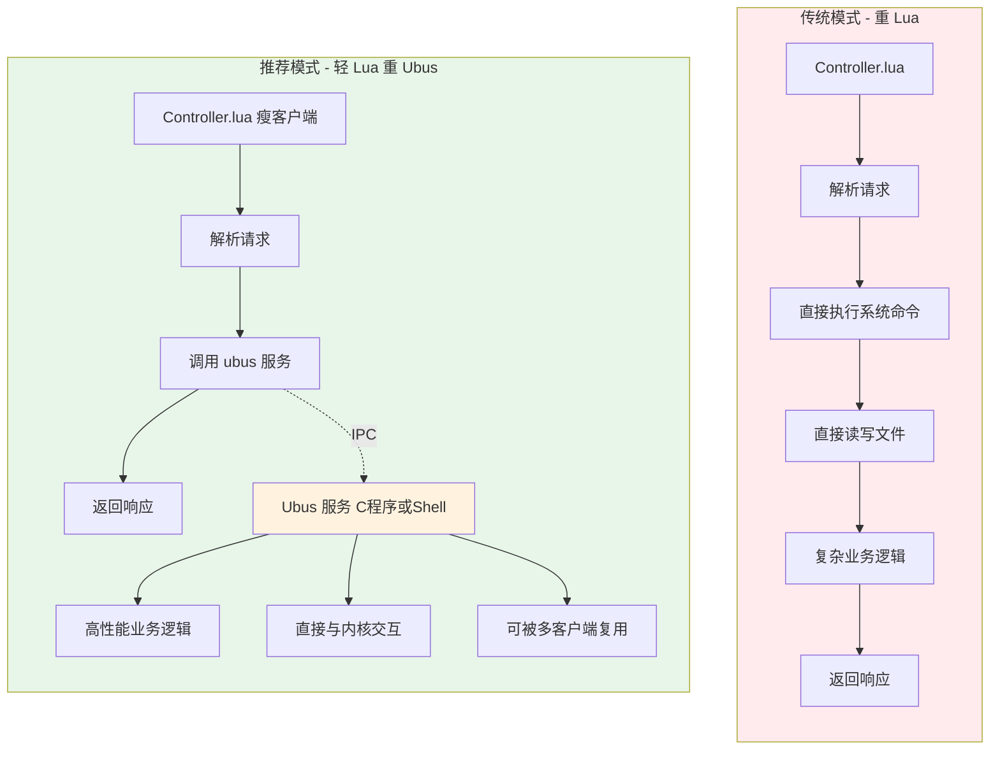
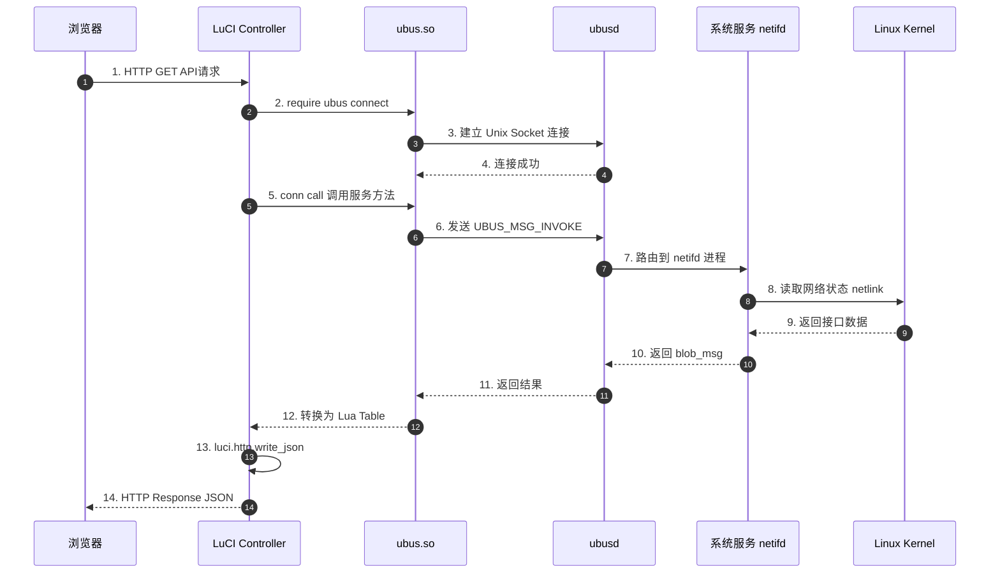

# OpenWrt LuCI 二次开发实战指导书

> **目标读者**：具有 Vue + Java Spring Boot 背景的开发者  
> **适用版本**：OpenWrt 24.10  
> **文档定位**：从概念理解到实战落地的完整指南

---

## 目录

- [快速入门（5分钟体验）](#快速入门5分钟体验)
- [1. 架构映射](#1-架构映射快速上手)
- [2. 核心技术栈拆解](#2-核心技术栈拆解)
- [3. 业务流程图](#3-业务流程图mermaid-格式)
- [4. 源码阅读指南](#4-源码阅读指南)
- [5. 二次开发实战步骤](#5-二次开发实战步骤)
- [6. 开发建议与调试](#6-开发建议与调试)
- [7. 现代开发工作流对标](#7-现代开发工作流对标)
- [8. 深度解析 Ubus](#8-深度解析-ubus-rpc-对标)
- [9. 权限管理](#9-权限管理-security)
- [10. OpenWrt 24.10 新特性](#10-openwrt-2410-新特性)
- [附录 A: 常见问题 FAQ](#附录-a-常见问题-faq)
- [附录 B: 开发环境搭建](#附录-b-开发环境搭建)
- [附录 C: 速查卡片](#附录-c-速查卡片)

---

## 快速入门（5分钟体验）

> 目标：在 5 分钟内完成第一个 LuCI 页面的创建

### Step 1: SSH 登录 OpenWrt 设备

```bash
ssh root@192.168.1.1
```

### Step 2: 创建 Controller（1分钟）

```bash
cat > /usr/lib/lua/luci/controller/myapp.lua << 'EOF'
module("luci.controller.myapp", package.seeall)

function index()
    entry({"admin", "myapp"}, template("myapp/hello"), "My App", 99)
end
EOF
```

### Step 3: 创建 View（1分钟）

```bash
mkdir -p /usr/lib/lua/luci/view/myapp

cat > /usr/lib/lua/luci/view/myapp/hello.htm << 'EOF'
<%+header%>
<h1>Hello, LuCI!</h1>
<p>当前时间: <%=os.date("%Y-%m-%d %H:%M:%S")%></p>
<p>系统运行时间: <%=luci.sys.uptime()%> 秒</p>
<%+footer%>
EOF
```

### Step 4: 清理缓存并访问（1分钟）

```bash
rm -rf /tmp/luci-*
/etc/init.d/uhttpd restart
```

打开浏览器访问：`http://192.168.1.1/cgi-bin/luci/admin/myapp`

### 恭喜！你已完成第一个 LuCI 页面 🎉

**接下来**：阅读下文了解 LuCI 架构原理，或直接跳转到[二次开发实战步骤](#5-二次开发实战步骤)创建更复杂的功能。

---

## 1. 架构映射（快速上手）

对于熟悉 Spring Boot + Vue 前后端分离架构的开发者，理解 LuCI 最快的方式是进行组件对标。

### 1.1 核心组件对比表

| LuCI 组件                           | Spring Boot + Vue 对应组件                | 功能说明                              |
| ----------------------------------- | ----------------------------------------- | ------------------------------------- |
| **Controller** (`controller/*.lua`) | Spring `@RestController`                  | 路由定义、请求处理、API 接口          |
| **CBI Model** (`model/cbi/*.lua`)   | Vue Form + Spring Service + JPA Entity    | 配置表单自动生成（类似于声明式 CRUD） |
| **View Template** (`view/*.htm`)    | Vue SFC (Single File Component)           | 自定义 HTML 页面，支持 AJAX 动态更新  |
| **UCI** (`/etc/config/*`)           | MySQL/PostgreSQL + application.yml        | 持久化配置存储（键值对形式）          |
| **ubus**                            | Spring Cloud 的 Feign/gRPC/Kafka          | 进程间通信总线（系统服务调用）        |
| **Lua**                             | Java (业务逻辑层)                         | 服务端脚本语言                        |
| **LuCI HTTP**                       | Spring MVC 的 HttpServletRequest/Response | HTTP 请求响应处理                     |
| **nixio**                           | Java NIO / Apache Commons IO              | 底层 I/O 和网络操作                   |

### 1.2 请求处理流程对比

**Spring Boot + Vue 架构**：

> Browser (Vue) → Nginx → Controller → Service → Repository → DB

**LuCI 架构**：

> Browser → uhttpd → Controller.lua → CBI/Logic → UCI → ConfigFile

### 1.3 Ubus 的角色定位

**类比理解**：Ubus 相当于 Spring Cloud 生态中的 **消息总线 + RPC 调用** 的结合体。

| Ubus 特性      | 对应的 Java 技术      |
| -------------- | --------------------- |
| 服务注册与发现 | Eureka/Nacos          |
| 同步方法调用   | Feign/gRPC            |
| 事件发布/订阅  | Spring Events / Kafka |
| JSON 数据交换  | Jackson/Gson          |

```bash
# 查看所有 Ubus 服务（类似于查看注册中心的服务列表）
ubus list

# 查看某服务的所有方法（类似于 Swagger 文档）
ubus list -v network.interface

# 调用服务方法（类似于 Feign 调用）
ubus call system info
```

---

## 2. 核心技术栈拆解

### 2.1 UCI (Unified Configuration Interface)

**类比**：UCI = **扁平化的 YAML 配置 + 简化版的 Key-Value 数据库**

#### UCI 文件结构示例

```bash
# 文件位置：/etc/config/network
# 类比：application.yml 中的 spring.datasource 配置段

config interface 'lan'           # Section（类似于 @Entity 或配置类）
    option proto 'static'        # Option（类似于字段/属性）
    option ipaddr '192.168.1.1'
    option netmask '255.255.255.0'
    list dns '8.8.8.8'           # List类型（类似于 List<String>）
    list dns '8.8.4.4'

config interface 'wan'
    option proto 'dhcp'
```

#### UCI 操作对比

| 操作     | UCI 命令/API                               | Java + Spring 对应操作                    |
| -------- | ------------------------------------------ | ----------------------------------------- |
| 读取配置 | `uci get network.lan.ipaddr`               | `configService.get("network.lan.ipaddr")` |
| 写入配置 | `uci set network.lan.ipaddr='192.168.2.1'` | `entity.setIpaddr("192.168.2.1")`         |
| 提交更改 | `uci commit network`                       | `repository.save(entity)`                 |
| 应用更改 | `/etc/init.d/network reload`               | 事务提交 + 缓存刷新                       |

#### Lua 中操作 UCI

```lua
-- 类比 Java 中的 JPA Repository 操作
local uci = require "luci.model.uci".cursor()

-- SELECT: 读取单个值
local ip = uci:get("network", "lan", "ipaddr")     -- 返回 "192.168.1.1"

-- SELECT ALL: 遍历所有同类型 Section
uci:foreach("network", "interface", function(section)
    print(section[".name"], section.proto)         -- 打印每个接口的名称和协议
end)

-- INSERT/UPDATE: 设置值
uci:set("network", "lan", "ipaddr", "192.168.2.1")

-- 事务提交（必须调用！否则更改不生效）
uci:commit("network")

-- DELETE: 删除配置项
uci:delete("network", "lan", "dns")                -- 删除 dns 选项
```

### 2.2 Lua 脚本在 LuCI 中的位置

**类比**：Lua 之于 LuCI = **Java 之于 Spring Boot**



> 📁 **路径**: `/usr/lib/lua/luci/`  
> ★ controller → 类比 @RestController | model/cbi → 类比 @Entity + Form | view → 类比 Vue Template

#### Lua 快速语法对照

```lua
-- Lua vs Java 语法快速对照

-- 变量声明
local name = "OpenWrt"           -- Java: String name = "OpenWrt";
local count = 100                -- Java: int count = 100;
local enabled = true             -- Java: boolean enabled = true;

-- 表/对象（Table 是 Lua 唯一的数据结构）
local config = {                 -- Java: Map<String, Object> config = new HashMap<>();
    host = "192.168.1.1",        --       config.put("host", "192.168.1.1");
    port = 80,                   --       config.put("port", 80);
    enabled = true               --       config.put("enabled", true);
}
print(config.host)               -- Java: config.get("host")
print(config["port"])            -- 另一种访问方式

-- 数组（也是 Table）
local list = {"a", "b", "c"}     -- Java: List<String> list = Arrays.asList("a", "b", "c");
print(list[1])                   -- 输出 "a"（注意：Lua 索引从 1 开始！）

-- 函数定义
local function greet(name)       -- Java: public String greet(String name) {
    return "Hello, " .. name     --     return "Hello, " + name;
end                              -- }

-- 条件判断
if count > 0 then                -- Java: if (count > 0) {
    print("positive")            --     System.out.println("positive");
elseif count < 0 then            -- } else if (count < 0) {
    print("negative")            --     System.out.println("negative");
else                             -- } else {
    print("zero")                --     System.out.println("zero");
end                              -- }

-- 循环
for i = 1, 10 do                 -- Java: for (int i = 1; i <= 10; i++)
    print(i)
end

for key, value in pairs(config) do    -- Java: for (Map.Entry<K,V> entry : map.entrySet())
    print(key .. " = " .. tostring(value))
end

-- 模块定义（类似于 Java 的 Class）
module("luci.controller.example", package.seeall)

function index()                 -- 类似于 @PostConstruct 或初始化方法
    -- 路由定义
end

function action_save()           -- 类似于 @RequestMapping("/save")
    -- 业务逻辑
end
```

### 2.3 LuCI 界面流（请求生命周期）



---

## 3. 业务流程图（Mermaid 格式）

### 3.1 用户修改配置并保存 - 序列图



### 3.2 API 调用流程 - 序列图



---

## 4. 源码阅读指南

### 4.1 LuCI 源码结构（编译前）

LuCI 源码位于 OpenWrt 的 feeds 中，通过 `./scripts/feeds update luci` 获取。

**源码仓库位置**：

```bash
# OpenWrt 构建目录下
feeds/luci/                     # LuCI 主仓库
├── applications/               # ⭐ 所有 luci-app-* 应用
│   ├── luci-app-firewall/      #    防火墙管理
│   ├── luci-app-opkg/          #    软件包管理
│   ├── luci-app-ddns/          #    动态DNS
│   └── luci-app-example/       #    示例应用（学习参考）
├── modules/                    # LuCI 核心模块
│   ├── luci-base/              # ⭐ 核心框架（必读）
│   ├── luci-mod-admin-full/    #    完整管理界面
│   ├── luci-mod-network/       #    网络模块
│   └── luci-mod-system/        #    系统模块
├── libs/                       # 依赖库
│   ├── luci-lib-base/          #    基础库
│   ├── luci-lib-ip/            #    IP处理库
│   └── luci-lib-jsonc/         #    JSON库
├── themes/                     # 主题
│   ├── luci-theme-bootstrap/   #    默认主题
│   └── luci-theme-openwrt/     #    经典主题
├── protocols/                  # 网络协议支持
├── collections/                # 软件包集合
└── contrib/                    # 贡献工具
```

**单个 luci-app 源码结构**（以 luci-app-firewall 为例）：

```bash
feeds/luci/applications/luci-app-firewall/
├── Makefile                    # ⭐ 编译配置（定义安装路径）
├── htdocs/                     # 静态资源（JS/CSS）
│   └── luci-static/
│       └── resources/
│           └── view/
│               └── firewall/   # JS 视图文件
├── luasrc/                     # ⭐ Lua 源码（传统模式）
│   ├── controller/
│   │   └── firewall.lua        # 控制器
│   ├── model/
│   │   └── cbi/
│   │       └── firewall/       # CBI 模型
│   └── view/
│       └── firewall/           # HTM 模板
├── root/                       # ⭐ 直接复制到根文件系统的文件
│   └── etc/
│       ├── config/
│       │   └── firewall        # UCI 默认配置
│       ├── init.d/
│       │   └── firewall        # 启动脚本
│       └── uci-defaults/
│           └── firewall        # 首次安装执行的脚本
└── po/                         # 多语言翻译
    ├── templates/
    │   └── firewall.pot        # 翻译模板
    ├── zh_Hans/                 # 简体中文（注意不是 zh_CN）
    │   └── firewall.po
    └── en/
        └── firewall.po
```

### 4.2 源码目录与编译后目录的映射关系

理解这个映射关系是开发的关键：

| 源码目录 (feeds/luci/...) | 编译后目录 (设备上)             | 说明                    |
| ------------------------- | ------------------------------- | ----------------------- |
| `luasrc/controller/`      | `/usr/lib/lua/luci/controller/` | 控制器                  |
| `luasrc/model/cbi/`       | `/usr/lib/lua/luci/model/cbi/`  | CBI 模型                |
| `luasrc/view/`            | `/usr/lib/lua/luci/view/`       | 视图模板                |
| `htdocs/luci-static/`     | `/www/luci-static/`             | 静态资源                |
| `root/etc/config/`        | `/etc/config/`                  | UCI 配置                |
| `root/etc/init.d/`        | `/etc/init.d/`                  | 启动脚本                |
| `po/zh_Hans/`             | `/usr/lib/lua/luci/i18n/`       | 翻译文件（编译为 .lmo） |

**Makefile 中的路径定义**：

```makefile
# feeds/luci/applications/luci-app-xxx/Makefile

include $(TOPDIR)/rules.mk

# 应用名称
LUCI_TITLE:=LuCI Support for XXX
LUCI_DEPENDS:=+luci-base +some-package

# 关键：指定源码目录映射
PKG_NAME:=luci-app-xxx

include $(TOPDIR)/feeds/luci/luci.mk

# luci.mk 会自动处理以下映射：
# luasrc/  →  /usr/lib/lua/luci/
# htdocs/  →  /www/
# root/    →  /  (直接复制)
```

### 4.3 luci-base 核心源码结构

`luci-base` 是整个 LuCI 的核心，位于 `feeds/luci/modules/luci-base/`：

```bash
feeds/luci/modules/luci-base/
├── luasrc/                     # Lua 核心库
│   └── luci/
│       ├── dispatcher.lua      # ⭐ 路由分发（入口）
│       ├── http.lua            # HTTP 请求处理
│       ├── util.lua            # 工具函数
│       ├── sys.lua             # 系统操作
│       ├── ip.lua              # IP 地址处理
│       ├── model/
│       │   ├── uci.lua         # ⭐ UCI 操作封装
│       │   └── network.lua     # 网络模型
│       ├── view/               # 核心视图
│       │   ├── header.htm      # 页面头
│       │   ├── footer.htm      # 页面尾
│       │   └── cbi/            # CBI 组件模板
│       └── cbi.lua             # ⭐ CBI 框架核心
├── htdocs/                     # 前端资源
│   └── luci-static/
│       └── resources/
│           ├── cbi.js          # CBI JavaScript
│           ├── luci.js         # LuCI 核心 JS
│           └── xhr.js          # AJAX 封装
└── root/
    └── www/
        └── cgi-bin/
            └── luci            # CGI 入口脚本
```

### 4.4 编译后的目录结构（设备上）

当 luci-app 编译安装到 OpenWrt 设备后：

```bash
/usr/lib/lua/luci/              # LuCI 核心代码目录
├── controller/                 # ⭐ 控制器层
│   ├── admin/                  #    后台管理
│   │   ├── index.lua           
│   │   ├── system.lua          
│   │   ├── network.lua         
│   │   └── status.lua          
│   ├── firewall.lua            #    来自 luci-app-firewall
│   └── api/                    #    API 接口
├── model/                  
│   ├── cbi/                    # ⭐ CBI 模型层
│   │   └── admin/
│   │       ├── system/
│   │       └── network/
│   ├── uci.lua                 #    UCI 操作
│   └── network.lua             #    网络模型
├── view/                       # ⭐ 视图模板层
│   ├── header.htm              
│   ├── footer.htm              
│   ├── cbi/                    #    CBI 组件
│   └── admin/
│       └── status/             
├── dispatcher.lua              # 路由分发器
├── http.lua                    # HTTP 工具
├── cbi.lua                     # CBI 框架
├── sys.lua                     # 系统操作
└── i18n/                       # 翻译文件 (.lmo)

/www/                           # Web 根目录
├── cgi-bin/
│   └── luci                    # CGI 入口
├── luci-static/                # 静态资源
│   └── resources/
│       ├── cbi.js
│       └── view/               # JS 视图
└── index.html

/etc/config/                    # UCI 配置文件
├── network                 
├── wireless                
├── firewall                
├── dhcp                    
└── system                  
```

### 4.5 如何找到特定功能的代码

**方法一：从 URL 反向查找（设备上）**

```bash
# 浏览器地址栏：/cgi-bin/luci/admin/network/network
# 提取路径：admin/network/network

# 在设备上查找 Controller
grep -r "admin.*network.*network" /usr/lib/lua/luci/controller/
# → /usr/lib/lua/luci/controller/admin/network.lua

# 查看 entry 定义找到 CBI 路径
# entry({"admin", "network", "network"}, cbi("admin/network/network"), ...)
# → /usr/lib/lua/luci/model/cbi/admin/network/network.lua
```

**方法二：从源码查找（开发环境）**

```bash
# 在 OpenWrt 构建目录下
cd feeds/luci

# 按功能关键字搜索
grep -rn "network" applications/*/luasrc/controller/
grep -rn "Interfaces" modules/*/po/templates/*.pot

# 找到后查看完整路径
find . -name "network.lua" -path "*/controller/*"
```

**方法三：通过 Git 查找**

```bash
# 克隆 LuCI 仓库
git clone https://github.com/openwrt/luci.git
cd luci

# 搜索特定功能
git grep "firewall" -- "*.lua"
git log --oneline --all -- applications/luci-app-firewall/
```

### 4.6 核心文件速查表

| 你想了解的内容 | 源码位置                                                     | 编译后位置                                  |
| -------------- | ------------------------------------------------------------ | ------------------------------------------- |
| 路由分发机制   | `modules/luci-base/luasrc/luci/dispatcher.lua`               | `/usr/lib/lua/luci/dispatcher.lua`          |
| CBI 框架核心   | `modules/luci-base/luasrc/luci/cbi.lua`                      | `/usr/lib/lua/luci/cbi.lua`                 |
| UCI 操作封装   | `modules/luci-base/luasrc/luci/model/uci.lua`                | `/usr/lib/lua/luci/model/uci.lua`           |
| HTTP 请求处理  | `modules/luci-base/luasrc/luci/http.lua`                     | `/usr/lib/lua/luci/http.lua`                |
| 防火墙控制器   | `applications/luci-app-firewall/luasrc/controller/firewall.lua` | `/usr/lib/lua/luci/controller/firewall.lua` |
| CBI 组件模板   | `modules/luci-base/luasrc/luci/view/cbi/`                    | `/usr/lib/lua/luci/view/cbi/`               |
| 前端 JS 库     | `modules/luci-base/htdocs/luci-static/resources/`            | `/www/luci-static/resources/`               |

### 4.7 推荐的源码阅读顺序

```
1. dispatcher.lua     → 理解请求如何被路由
       ↓
2. 任意 controller    → 理解 entry() 如何定义路由和菜单
       ↓
3. cbi.lua            → 理解 CBI 框架如何工作
       ↓
4. 任意 CBI model     → 理解如何定义配置表单
       ↓
5. model/uci.lua      → 理解 UCI 操作 API
       ↓
6. view/cbi/*.htm     → 理解 CBI 组件如何渲染
```

---

## 5. 二次开发实战步骤

### 5.1 增加一个菜单

**目标**：在「服务」下添加一个「安全网关」菜单

**Step 1: 创建 Controller 文件**

```lua
-- 文件路径：/usr/lib/lua/luci/controller/admin/security_gateway.lua

module("luci.controller.admin.security_gateway", package.seeall)

function index()
    -- 检查权限（可选）
    -- if not nixio.fs.access("/etc/config/security_gateway") then
    --     return
    -- end
    
    -- 一级菜单：安全网关
    -- entry(路径数组, 目标, 菜单标题, 排序权重)
    entry(
        {"admin", "services", "security_gateway"},  -- URL: /admin/services/security_gateway
        firstchild(),                                -- 跳转到第一个子菜单
        _("Security Gateway"),                       -- 菜单显示名称（支持翻译）
        60                                           -- 排序权重（数字越小越靠前）
    )
    
    -- 二级菜单：基本配置
    entry(
        {"admin", "services", "security_gateway", "config"},
        cbi("security_gateway/config"),              -- 加载 CBI 模型
        _("Basic Config"),
        10
    )
    
    -- 二级菜单：状态监控
    entry(
        {"admin", "services", "security_gateway", "status"},
        template("security_gateway/status"),         -- 加载 HTML 模板
        _("Status"),
        20
    )
    
    -- API 接口（不显示在菜单中）
    entry(
        {"admin", "services", "security_gateway", "api", "stats"},
        call("action_get_stats"),                    -- 调用函数
        nil                                          -- nil 表示不显示菜单
    ).leaf = true                                    -- 标记为叶子节点
end

-- API 处理函数
function action_get_stats()
    local sys = require "luci.sys"
    
    local stats = {
        cpu_usage = get_cpu_usage(),
        memory_usage = get_memory_usage(),
        connections = get_active_connections(),
        uptime = sys.uptime()
    }
    
    -- 返回 JSON（类似 Spring 的 @ResponseBody）
    luci.http.prepare_content("application/json")
    luci.http.write_json(stats)
end

-- 辅助函数
function get_cpu_usage()
    local load = luci.sys.loadavg()
    return string.format("%.1f%%", load[1] * 100)
end

function get_memory_usage()
    local mem = luci.sys.exec("free | grep Mem | awk '{print int($3/$2*100)}'")
    return mem:gsub("\n", "") .. "%"
end

function get_active_connections()
    local count = luci.sys.exec("cat /proc/sys/net/netfilter/nf_conntrack_count")
    return tonumber(count) or 0
end
```

### 5.2 创建配置页面（CBI 模型）

**目标**：创建一个带 CRUD 功能的配置表单

**Step 1: 创建 UCI 配置文件**

```bash
# 文件路径：/etc/config/security_gateway

config basic 'main'
    option enabled '1'
    option log_level 'info'
    option max_connections '10000'

config rule
    option name 'Block SSH'
    option src 'wan'
    option dest_port '22'
    option action 'drop'
    option enabled '1'

config rule
    option name 'Allow HTTP'
    option src 'wan'
    option dest_port '80'
    option action 'accept'
    option enabled '1'
```

**Step 2: 创建 CBI 模型**

```lua
-- 文件路径：/usr/lib/lua/luci/model/cbi/security_gateway/config.lua

-- 引入翻译函数
local m, s, o

-- 创建 Map（对应 UCI 配置文件）
-- Map("配置文件名", "页面标题", "页面描述")
m = Map("security_gateway", 
    translate("Security Gateway Configuration"),
    translate("Configure security gateway settings and rules."))

-- ==================== Section 1: 基本设置 ====================
-- NamedSection: 指定名称的 section（单例配置）
-- 类比：Spring Boot 的 application.yml 中的固定配置项
s = m:section(NamedSection, "main", "basic", translate("Basic Settings"))
s.addremove = false  -- 不允许删除此 section

-- 开关选项
o = s:option(Flag, "enabled", translate("Enable"))
o.default = "1"
o.rmempty = false    -- 不允许为空

-- 下拉选择
o = s:option(ListValue, "log_level", translate("Log Level"))
o:value("debug", translate("Debug"))
o:value("info", translate("Info"))
o:value("warning", translate("Warning"))
o:value("error", translate("Error"))
o.default = "info"

-- 数值输入
o = s:option(Value, "max_connections", translate("Max Connections"))
o.datatype = "uinteger"          -- 数据类型：无符号整数
o.placeholder = "10000"          -- 占位符提示
o.rmempty = false

-- ==================== Section 2: 安全规则（列表） ====================
-- TypedSection: 指定类型的所有 section（多条记录）
-- 类比：JPA 的 findAll() 查询结果
s = m:section(TypedSection, "rule", translate("Security Rules"))
s.template = "cbi/tblsection"    -- 使用表格样式
s.anonymous = false              -- 显示 section 名称
s.addremove = true               -- 允许增删
s.sortable = true                -- 允许排序

-- 规则名称
o = s:option(Value, "name", translate("Name"))
o.rmempty = false

-- 来源区域
o = s:option(ListValue, "src", translate("Source Zone"))
o:value("wan", "WAN")
o:value("lan", "LAN")
o:value("*", translate("Any"))

-- 目标端口
o = s:option(Value, "dest_port", translate("Destination Port"))
o.datatype = "port"              -- 自动验证端口范围 1-65535
o.placeholder = "80"

-- 动作
o = s:option(ListValue, "action", translate("Action"))
o:value("accept", translate("Accept"))
o:value("drop", translate("Drop"))
o:value("reject", translate("Reject"))

-- 启用开关
o = s:option(Flag, "enabled", translate("Enabled"))
o.default = "1"

-- 返回 Map 对象（必须）
return m
```

**Step 3: CBI Option 类型速查**

| Option 类型   | 对应的表单元素            | 典型用途          |
| ------------- | ------------------------- | ----------------- |
| `Value`       | `<input type="text">`     | 文本输入          |
| `Flag`        | `<input type="checkbox">` | 开关/布尔值       |
| `ListValue`   | `<select>`                | 单选下拉框        |
| `MultiValue`  | `<select multiple>`       | 多选              |
| `TextValue`   | `<textarea>`              | 多行文本          |
| `DynamicList` | 动态添加的输入列表        | 如 DNS 服务器列表 |
| `Button`      | `<button>`                | 执行操作          |

**Step 4: 数据类型验证（datatype）**

```lua
-- 常用 datatype 列表
o.datatype = "string"       -- 字符串
o.datatype = "uinteger"     -- 无符号整数 (≥0)
o.datatype = "integer"      -- 整数
o.datatype = "float"        -- 浮点数
o.datatype = "port"         -- 端口号 (1-65535)
o.datatype = "portrange"    -- 端口范围 (如 80-443)
o.datatype = "ipaddr"       -- IP 地址 (v4 或 v6)
o.datatype = "ip4addr"      -- IPv4 地址
o.datatype = "ip6addr"      -- IPv6 地址
o.datatype = "macaddr"      -- MAC 地址
o.datatype = "hostname"     -- 主机名
o.datatype = "host"         -- 主机名或 IP
o.datatype = "network"      -- 网络地址 (如 192.168.1.0/24)
o.datatype = "range(1,100)" -- 范围验证
```

### 5.3 前后端交互（AJAX API 调用）

**目标**：前端通过 JavaScript 调用后端 Lua 函数

**Step 1: Controller 中定义 API**

```lua
-- 在 controller/admin/security_gateway.lua 中添加

function index()
    -- ... 之前的菜单定义 ...
    
    -- API: 获取实时统计
    entry({"admin", "services", "security_gateway", "api", "realtime"},
          call("api_realtime"), nil).leaf = true
    
    -- API: 执行操作
    entry({"admin", "services", "security_gateway", "api", "action"},
          call("api_action"), nil).leaf = true
end

-- GET API: 返回 JSON 数据
function api_realtime()
    local ubus = require "ubus"
    local conn = ubus.connect()
    
    if not conn then
        luci.http.status(500, "Internal Server Error")
        luci.http.prepare_content("application/json")
        luci.http.write_json({error = "Failed to connect to ubus"})
        return
    end
    
    -- 通过 ubus 获取系统信息
    local sysinfo = conn:call("system", "info", {})
    conn:close()
    
    local data = {
        uptime = sysinfo.uptime,
        load = sysinfo.load,
        memory = {
            total = sysinfo.memory.total,
            free = sysinfo.memory.free,
            used = sysinfo.memory.total - sysinfo.memory.free
        },
        timestamp = os.time()
    }
    
    luci.http.prepare_content("application/json")
    luci.http.write_json(data)
end

-- POST API: 执行操作
function api_action()
    -- 获取 POST 参数（类似 @RequestBody）
    local action = luci.http.formvalue("action")
    local target = luci.http.formvalue("target")
    
    local result = {success = false}
    
    if action == "restart_service" then
        local exit_code = os.execute("/etc/init.d/" .. target .. " restart")
        result.success = (exit_code == 0)
        result.message = result.success and "Service restarted" or "Restart failed"
    elseif action == "clear_logs" then
        os.execute("echo '' > /var/log/security_gateway.log")
        result.success = true
        result.message = "Logs cleared"
    else
        result.message = "Unknown action"
    end
    
    luci.http.prepare_content("application/json")
    luci.http.write_json(result)
end
```

**Step 2: View 模板中的 JavaScript 调用**

```html
<!-- 文件路径：/usr/lib/lua/luci/view/security_gateway/status.htm -->

<%+header%>

<h2><%:Security Gateway Status%></h2>

<div class="cbi-section">
    <div class="cbi-value">
        <label class="cbi-value-title"><%:System Uptime%></label>
        <div class="cbi-value-field" id="uptime">Loading...</div>
    </div>
    
    <div class="cbi-value">
        <label class="cbi-value-title"><%:CPU Load%></label>
        <div class="cbi-value-field" id="load">Loading...</div>
    </div>
    
    <div class="cbi-value">
        <label class="cbi-value-title"><%:Memory Usage%></label>
        <div class="cbi-value-field">
            <div id="memory-bar" class="progress-bar">
                <div id="memory-used" class="progress-fill"></div>
            </div>
            <span id="memory-text"></span>
        </div>
    </div>
</div>

<div class="cbi-section">
    <h3><%:Quick Actions%></h3>
    <button class="cbi-button cbi-button-action" onclick="restartService()">
        <%:Restart Service%>
    </button>
    <button class="cbi-button cbi-button-reset" onclick="clearLogs()">
        <%:Clear Logs%>
    </button>
</div>

<style>
.progress-bar {
    width: 200px;
    height: 20px;
    background-color: #eee;
    border-radius: 4px;
    display: inline-block;
}
.progress-fill {
    height: 100%;
    background-color: #5bc0de;
    border-radius: 4px;
    transition: width 0.3s;
}
</style>

<script type="text/javascript">
//<![CDATA[

// API URL 构造（使用 LuCI 模板函数）
var apiUrl = '<%=url("admin", "services", "security_gateway", "api", "realtime")%>';
var actionUrl = '<%=url("admin", "services", "security_gateway", "api", "action")%>';

// 格式化运行时间
function formatUptime(seconds) {
    var days = Math.floor(seconds / 86400);
    var hours = Math.floor((seconds % 86400) / 3600);
    var mins = Math.floor((seconds % 3600) / 60);
    return days + 'd ' + hours + 'h ' + mins + 'm';
}

// 更新页面数据
function updateStats() {
    XHR.get(apiUrl, null, function(xhr, data) {
        if (data) {
            // 更新运行时间
            document.getElementById('uptime').innerHTML = formatUptime(data.uptime);
            
            // 更新 CPU 负载
            var load = data.load.join(', ');
            document.getElementById('load').innerHTML = load;
            
            // 更新内存使用
            var memPercent = Math.round((data.memory.used / data.memory.total) * 100);
            document.getElementById('memory-used').style.width = memPercent + '%';
            document.getElementById('memory-text').innerHTML = 
                Math.round(data.memory.used/1024/1024) + 'MB / ' + 
                Math.round(data.memory.total/1024/1024) + 'MB (' + memPercent + '%)';
        }
    });
}

// POST 请求执行操作
function restartService() {
    if (!confirm('<%:Are you sure to restart the service?%>')) return;
    
    XHR.post(actionUrl, {action: 'restart_service', target: 'security_gateway'}, 
        function(xhr, data) {
            if (data && data.success) {
                alert('<%:Service restarted successfully%>');
            } else {
                alert('<%:Operation failed%>: ' + (data ? data.message : 'Unknown error'));
            }
        }
    );
}

function clearLogs() {
    if (!confirm('<%:Are you sure to clear all logs?%>')) return;
    
    XHR.post(actionUrl, {action: 'clear_logs'}, function(xhr, data) {
        if (data && data.success) {
            alert('<%:Logs cleared%>');
        }
    });
}

// 初始加载
updateStats();

// 每 5 秒自动刷新
setInterval(updateStats, 5000);

//]]>
</script>

<%+footer%>
```

---

## 6. 开发建议与调试

### 6.1 日志调试大法

```lua
-- 方法 1: 写入系统日志（推荐）
-- 查看方式：logread | grep myapp
luci.sys.exec("logger -t myapp 'Debug: variable = " .. tostring(variable) .. "'")

-- 方法 2: 写入 stderr（开发环境）
io.stderr:write("DEBUG: " .. tostring(value) .. "\n")

-- 方法 3: 写入文件
local f = io.open("/tmp/debug.log", "a")
f:write(os.date("%Y-%m-%d %H:%M:%S") .. " - " .. message .. "\n")
f:close()

-- 方法 4: 返回给浏览器（API 调试）
function debug_api()
    local debug_info = {
        request_method = luci.http.getenv("REQUEST_METHOD"),
        request_uri = luci.http.getenv("REQUEST_URI"),
        form_data = luci.http.formvalue(),
        -- 更多调试信息...
    }
    luci.http.prepare_content("application/json")
    luci.http.write_json(debug_info)
end
```

### 6.2 常用调试命令

```bash
# 查看实时日志
logread -f

# 过滤特定标签的日志
logread | grep luci
logread | grep myapp

# 查看 uhttpd 错误
cat /var/log/uhttpd.err

# 测试 UCI 配置
uci show security_gateway
uci get security_gateway.main.enabled

# 测试 ubus 调用
ubus call system info
ubus list -v

# 查看 Lua 语法错误
lua -e "require('luci.controller.admin.security_gateway')"
```

### 6.3 清理 LuCI 缓存

```bash
# ⭐ 修改代码后必须执行（否则改动不生效！）

# 方法 1: 删除编译缓存
rm -rf /tmp/luci-*

# 方法 2: 重启 uhttpd（推荐）
/etc/init.d/uhttpd restart

# 方法 3: 完整清理
rm -rf /tmp/luci-modulecache
rm -rf /tmp/luci-indexcache  
rm -rf /tmp/luci-sessions/*
/etc/init.d/uhttpd restart

# 方法 4: 创建清理脚本
cat > /usr/bin/luci-reload << 'EOF'
#!/bin/sh
rm -rf /tmp/luci-*
/etc/init.d/uhttpd restart
echo "LuCI cache cleared and restarted"
EOF
chmod +x /usr/bin/luci-reload

# 使用
luci-reload
```

### 6.4 常见错误排查

| 错误现象                  | 可能原因                      | 解决方案                           |
| ------------------------- | ----------------------------- | ---------------------------------- |
| 500 Internal Server Error | Lua 语法错误                  | `lua -e "require('...')"` 检查语法 |
| 菜单不显示                | Controller 未正确加载         | 检查 module 定义，清理缓存         |
| CBI 页面空白              | Map 文件路径错误              | 检查 `cbi("path")` 与文件位置      |
| 保存后配置未生效          | 未 commit 或未 reload         | 检查 `uci:commit()`                |
| AJAX 请求 404             | entry 定义缺失 `.leaf = true` | 添加 `.leaf = true`                |
| 中文乱码                  | 翻译文件编码问题              | 确保 po 文件为 UTF-8               |

---

## 7. 现代开发工作流对标

### 7.1 热部署方案

**对于习惯 `npm run dev` 的开发者**：LuCI 没有原生的 Hot Module Replacement，但可以通过以下方式实现快速反馈循环。

#### 方案 A: 禁用缓存 + SSH 实时同步

```bash
# Step 1: 在开发机上安装 fswatch（macOS）或 inotify-tools（Linux）
# macOS
brew install fswatch

# Linux
apt install inotify-tools

# Step 2: 创建同步脚本
cat > sync-to-openwrt.sh << 'EOF'
#!/bin/bash
REMOTE_HOST="192.168.1.1"
REMOTE_USER="root"
LOCAL_DIR="./luci-app-myapp/luasrc"
REMOTE_DIR="/usr/lib/lua/luci"

# 同步文件
rsync -avz --delete $LOCAL_DIR/ $REMOTE_USER@$REMOTE_HOST:$REMOTE_DIR/

# 清理远程缓存
ssh $REMOTE_USER@$REMOTE_HOST 'rm -rf /tmp/luci-* && /etc/init.d/uhttpd restart'

echo "Synced and reloaded at $(date)"
EOF
chmod +x sync-to-openwrt.sh

# Step 3: 监听文件变化自动同步
# macOS
fswatch -o ./luci-app-myapp | xargs -n1 ./sync-to-openwrt.sh

# Linux
inotifywait -m -r -e modify,create,delete ./luci-app-myapp | while read; do
    ./sync-to-openwrt.sh
done
```

#### 方案 B: 禁用 Lua 字节码缓存

```bash
# 在 OpenWrt 设备上执行

# 编辑 uhttpd 配置
uci set uhttpd.main.lua_prefix='/cgi-bin/luci'
uci set uhttpd.main.lua_handler='/usr/lib/lua/luci/sgi/uhttpd.lua'
uci set uhttpd.main.no_cache='1'
uci commit uhttpd

# 禁用 Lua 编译缓存
echo 'export LUA_DISABLE_CACHE=1' >> /etc/profile

# 重启
/etc/init.d/uhttpd restart
```

#### 方案 C: VS Code Remote SSH 直接编辑

```json
// .vscode/settings.json
{
    "remote.SSH.defaultExtensions": [
        "sumneko.lua"
    ],
    "files.associations": {
        "*.htm": "html",
        "*.lua": "lua"
    }
}
```

### 7.2 API 模式开发（类比 Spring Boot Controller）

**目标**：像编写 RESTful API 一样开发 LuCI 接口

```lua
-- 文件：/usr/lib/lua/luci/controller/api/v1.lua
-- 类比：Spring Boot 的 @RestController

module("luci.controller.api.v1", package.seeall)

-- 需要登录验证的 API
local function auth_required(func)
    return function()
        local sauth = require "luci.sauth"
        local sess = sauth.read()
        
        if not sess or not sess.username then
            luci.http.status(401, "Unauthorized")
            luci.http.prepare_content("application/json")
            luci.http.write_json({error = "Authentication required"})
            return
        end
        
        return func()
    end
end

function index()
    -- 公开 API
    local api = entry({"api", "v1"}, firstchild(), nil)
    api.sysauth = false  -- 不需要系统认证
    
    -- 系统信息 (无需认证)
    entry({"api", "v1", "system", "info"}, call("api_system_info"), nil).leaf = true
    
    -- 网络配置 (需要认证)
    entry({"api", "v1", "network", "interfaces"}, 
          call(auth_required(api_network_interfaces)), nil).leaf = true
    
    -- POST: 修改配置 (需要认证)
    entry({"api", "v1", "network", "interface", "update"},
          post("api_update_interface"), nil).leaf = true
end

-- GET /api/v1/system/info
function api_system_info()
    local ubus = require "ubus"
    local conn = ubus.connect()
    
    local board = conn:call("system", "board", {})
    local info = conn:call("system", "info", {})
    conn:close()
    
    local response = {
        hostname = board.hostname,
        model = board.model,
        kernel = board.kernel,
        uptime = info.uptime,
        load = info.load,
        memory = info.memory
    }
    
    send_json(200, response)
end

-- GET /api/v1/network/interfaces
function api_network_interfaces()
    local ubus = require "ubus"
    local conn = ubus.connect()
    
    local dump = conn:call("network.interface", "dump", {})
    conn:close()
    
    local interfaces = {}
    for _, iface in ipairs(dump.interface or {}) do
        table.insert(interfaces, {
            name = iface.interface,
            proto = iface.proto,
            up = iface.up,
            ipaddr = iface["ipv4-address"] and iface["ipv4-address"][1] 
                     and iface["ipv4-address"][1].address or nil
        })
    end
    
    send_json(200, {interfaces = interfaces})
end

-- POST /api/v1/network/interface/update
function api_update_interface()
    -- 获取请求体
    local content_type = luci.http.getenv("CONTENT_TYPE") or ""
    local body = {}
    
    if content_type:find("application/json") then
        -- 解析 JSON 请求体
        local raw = luci.http.content()
        local json = require "luci.jsonc"
        body = json.parse(raw) or {}
    else
        -- 表单数据
        body = luci.http.formvalue()
    end
    
    -- 参数验证
    if not body.interface or not body.ipaddr then
        send_json(400, {error = "Missing required fields: interface, ipaddr"})
        return
    end
    
    -- 更新配置
    local uci = require "luci.model.uci".cursor()
    uci:set("network", body.interface, "ipaddr", body.ipaddr)
    
    if body.netmask then
        uci:set("network", body.interface, "netmask", body.netmask)
    end
    
    uci:commit("network")
    
    -- 重新加载网络
    os.execute("/etc/init.d/network reload")
    
    send_json(200, {
        success = true,
        message = "Interface updated",
        interface = body.interface
    })
end

-- 辅助函数：发送 JSON 响应
function send_json(status, data)
    luci.http.status(status)
    luci.http.prepare_content("application/json")
    luci.http.write_json(data)
end
```

**前端调用示例**（Vue/JavaScript）：

```javascript
// 类比 axios 调用 Spring Boot API

// 获取系统信息
fetch('/api/v1/system/info')
    .then(res => res.json())
    .then(data => console.log(data));

// 更新网络配置（需要认证）
fetch('/api/v1/network/interface/update', {
    method: 'POST',
    headers: {
        'Content-Type': 'application/json',
        'Cookie': 'sysauth=YOUR_SESSION_TOKEN'  // 登录后获取
    },
    body: JSON.stringify({
        interface: 'lan',
        ipaddr: '192.168.2.1',
        netmask: '255.255.255.0'
    })
})
.then(res => res.json())
.then(data => console.log(data));
```

---

## 8. 深度解析 Ubus (RPC 对标)

### 8.1 Ubus 架构图



### 8.2 "轻 Lua，重 Ubus" 模式

**为什么推荐这种模式？**



**问题对比**：传统模式下 Lua 性能较低，并发能力差，无法复用逻辑

**优势对比**：

| 维度 | 重 Lua 模式      | 轻 Lua + 重 Ubus 模式 |
| ---- | ---------------- | --------------------- |
| 性能 | 较差（解释执行） | 高（C 原生执行）      |
| 并发 | 单线程阻塞       | 多进程/多线程         |
| 复用 | 仅限 LuCI        | CLI、其他程序均可调用 |
| 维护 | 混合代码难维护   | 职责清晰              |
| 安全 | 权限控制较弱     | Ubus ACL 统一管理     |

### 8.3 Ubus 完整交互流程



### 8.4 自定义 Ubus 服务示例

**Lua 版本（适合快速原型）**：

```lua
#!/usr/bin/lua
-- 文件：/usr/sbin/my-ubus-service
-- 类比：Spring Boot 的 @Service

local ubus = require "ubus"
local uloop = require "uloop"

uloop.init()

local conn = ubus.connect()
if not conn then
    error("Failed to connect to ubus")
end

-- 定义服务方法（类似于 @RequestMapping）
local methods = {
    ["security.gateway"] = {
        -- 方法1：获取统计信息
        get_stats = {
            function(req, msg)
                local stats = {
                    active_connections = get_connection_count(),
                    blocked_ips = get_blocked_count(),
                    cpu_usage = get_cpu_usage(),
                    uptime = get_uptime()
                }
                conn:reply(req, stats)
            end, 
            {}  -- 无参数
        },
        
        -- 方法2：阻止 IP
        block_ip = {
            function(req, msg)
                if not msg.ip then
                    conn:reply(req, {error = "IP address required"})
                    return
                end
                
                local success = add_to_blacklist(msg.ip, msg.reason or "Manual block")
                conn:reply(req, {
                    success = success,
                    message = success and "IP blocked" or "Failed to block IP"
                })
            end, 
            {ip = ubus.STRING, reason = ubus.STRING}  -- 参数定义
        },
        
        -- 方法3：获取黑名单
        get_blacklist = {
            function(req, msg)
                local list = read_blacklist()
                conn:reply(req, {blacklist = list, count = #list})
            end, 
            {}
        }
    }
}

-- 注册服务
conn:add(methods)
print("Security gateway ubus service started")

-- 进入事件循环
uloop.run()
```

**测试服务**：

```bash
# 启动服务
/usr/sbin/my-ubus-service &

# 测试调用
ubus call security.gateway get_stats
ubus call security.gateway block_ip '{"ip": "10.0.0.100", "reason": "DDoS"}'
ubus call security.gateway get_blacklist
```

**在 LuCI 中调用**：

```lua
function api_security_stats()
    local conn = ubus.connect()
    local stats = conn:call("security.gateway", "get_stats", {})
    conn:close()
    
    luci.http.prepare_content("application/json")
    luci.http.write_json(stats)
end
```

---

## 9. 权限管理 (Security)

### 9.1 LuCI ACL 与 Spring Security 对比

| 概念         | Spring Security                     | LuCI ACL               |
| ------------ | ----------------------------------- | ---------------------- |
| 角色定义     | `@PreAuthorize("hasRole('ADMIN')")` | ACL JSON 配置          |
| 权限检查     | Filter Chain                        | `luci.dispatcher` 检查 |
| Session 管理 | Spring Session                      | `/tmp/luci-sessions/`  |
| 认证方式     | Form Login / JWT                    | `luci.sauth` 模块      |

### 9.2 ACL 配置结构

LuCI ACL 配置文件位置：`/usr/share/rpcd/acl.d/`

```json
// 文件：/usr/share/rpcd/acl.d/security_gateway.json
{
    // 角色1：系统管理员（完整权限）
    "security-admin": {
        "description": "Security Gateway Administrator",
        "read": {
            // UCI 读取权限
            "uci": [
                "security_gateway",
                "firewall",
                "network"
            ],
            // Ubus 调用权限
            "ubus": {
                "security.gateway": ["*"],
                "system": ["info", "board"],
                "network.interface": ["dump", "status"]
            },
            // 文件读取权限
            "file": {
                "/var/log/security*.log": ["read"]
            }
        },
        "write": {
            "uci": [
                "security_gateway",
                "firewall"
            ],
            "ubus": {
                "security.gateway": ["block_ip", "unblock_ip", "update_rules"]
            },
            "file": {
                "/etc/config/security_gateway": ["write"]
            }
        }
    },
    
    // 角色2：操作员（基本配置权限）
    "security-operator": {
        "description": "Security Gateway Operator",
        "read": {
            "uci": ["security_gateway"],
            "ubus": {
                "security.gateway": ["get_stats", "get_blacklist"],
                "system": ["info"]
            }
        },
        "write": {
            "uci": ["security_gateway"],
            "ubus": {
                "security.gateway": ["block_ip"]
            }
        }
    },
    
    // 角色3：审计员（只读权限）
    "security-auditor": {
        "description": "Security Gateway Auditor",
        "read": {
            "uci": ["security_gateway"],
            "ubus": {
                "security.gateway": ["get_stats", "get_blacklist", "get_logs"]
            },
            "file": {
                "/var/log/*.log": ["read"]
            }
        },
        "write": {}
    }
}
```

### 9.3 用户角色配置

```bash
# 文件：/etc/config/rpcd

config login
    option username 'admin'
    option password '$p$admin'         # 加密密码
    list read 'security-admin'          # 分配角色
    list write 'security-admin'

config login
    option username 'operator'
    option password '$p$operator'
    list read 'security-operator'
    list write 'security-operator'

config login
    option username 'auditor'
    option password '$p$auditor'
    list read 'security-auditor'
    # 注意：auditor 没有 write 权限
```

### 9.4 Controller 中的权限检查

```lua
-- 在 Controller 中实现权限检查
module("luci.controller.admin.security_gateway", package.seeall)

-- 权限检查装饰器
local function require_permission(permission)
    return function(func)
        return function(...)
            local sess = require("luci.sauth").read()
            
            if not sess then
                luci.http.status(401, "Unauthorized")
                luci.http.redirect(luci.dispatcher.build_url("admin"))
                return
            end
            
            -- 检查权限（简化版，实际应查询 ACL）
            local acl = require("luci.acl")
            if not acl.check(sess.user, permission) then
                luci.http.status(403, "Forbidden")
                luci.template.render("error403", {
                    message = "You don't have permission to access this page"
                })
                return
            end
            
            return func(...)
        end
    end
end

function index()
    -- 一级菜单（所有登录用户可见）
    entry({"admin", "services", "security_gateway"}, firstchild(), _("Security Gateway"), 60)
    
    -- 状态页面（所有角色可查看）
    entry({"admin", "services", "security_gateway", "status"}, 
          template("security_gateway/status"), _("Status"), 10)
    
    -- 配置页面（仅 admin 和 operator）
    entry({"admin", "services", "security_gateway", "config"},
          cbi("security_gateway/config"), _("Configuration"), 20)
          .sysauth_authenticator = "admin_operator"  -- 自定义验证器
    
    -- 用户管理（仅 admin）
    entry({"admin", "services", "security_gateway", "users"},
          call("action_users"), _("User Management"), 30)
          .sysauth = "admin"  -- 仅 admin 用户
    
    -- 审计日志（仅 admin 和 auditor）
    entry({"admin", "services", "security_gateway", "audit"},
          template("security_gateway/audit"), _("Audit Logs"), 40)
          .sysauth_authenticator = "admin_auditor"
end

-- 自定义验证器
function admin_operator_authenticator(validator, accs, defaults)
    local user = luci.http.getcookie("sysauth")
    local sess = luci.sauth.read(user)
    
    if sess and (sess.role == "admin" or sess.role == "operator") then
        return true
    end
    return false
end

function admin_auditor_authenticator(validator, accs, defaults)
    local user = luci.http.getcookie("sysauth")
    local sess = luci.sauth.read(user)
    
    if sess and (sess.role == "admin" or sess.role == "auditor") then
        return true
    end
    return false
end
```

### 9.5 完整的认证流程

```lua
-- 文件：/usr/lib/lua/luci/controller/auth.lua

module("luci.controller.auth", package.seeall)

function index()
    -- 登录页面（无需认证）
    entry({"admin", "login"}, template("admin/login"), nil)
    
    -- 登录 API
    entry({"admin", "login", "do"}, post("action_login"), nil)
    
    -- 登出
    entry({"admin", "logout"}, call("action_logout"), nil)
end

function action_login()
    local username = luci.http.formvalue("username")
    local password = luci.http.formvalue("password")
    local client_ip = luci.http.getenv("REMOTE_ADDR")
    
    -- 1. 参数验证
    if not username or not password then
        return send_error("用户名和密码不能为空")
    end
    
    -- 2. 检查账号是否被锁定
    if is_account_locked(username) then
        log_login_attempt(username, client_ip, "LOCKED")
        return send_error("账号已被锁定，请30分钟后重试")
    end
    
    -- 3. 验证用户（从 UCI 或 shadow 文件）
    local user = authenticate_user(username, password)
    if not user then
        record_failed_attempt(username)
        log_login_attempt(username, client_ip, "FAILED")
        return send_error("用户名或密码错误")
    end
    
    -- 4. 检查 IP 白名单
    if not is_ip_allowed(client_ip, user.allowed_ips) then
        log_login_attempt(username, client_ip, "IP_BLOCKED")
        return send_error("当前 IP 不允许登录")
    end
    
    -- 5. 检查是否已经在其他地方登录
    if is_session_exists(username) and not user.allow_multi_login then
        return send_error("该用户已在其他地方登录")
    end
    
    -- 6. 创建 Session
    local session_token = create_session(username, user.role, client_ip)
    
    -- 7. 设置 Cookie
    luci.http.header("Set-Cookie", 
        "sysauth=" .. session_token .. "; Path=/; HttpOnly; Secure")
    
    -- 8. 记录登录日志
    log_login_attempt(username, client_ip, "SUCCESS")
    
    -- 9. 返回成功
    luci.http.prepare_content("application/json")
    luci.http.write_json({
        success = true,
        username = username,
        role = user.role,
        redirect = luci.dispatcher.build_url("admin", "status", "overview")
    })
end

function action_logout()
    local token = luci.http.getcookie("sysauth")
    
    if token then
        destroy_session(token)
    end
    
    luci.http.header("Set-Cookie", 
        "sysauth=; Path=/; HttpOnly; Secure; Expires=Thu, 01 Jan 1970 00:00:00 GMT")
    
    luci.http.redirect(luci.dispatcher.build_url("admin", "login"))
end

-- 辅助函数
function authenticate_user(username, password)
    local uci = require("luci.model.uci").cursor()
    
    local stored_hash = uci:get("users", username, "password")
    local stored_salt = uci:get("users", username, "salt")
    local role = uci:get("users", username, "role")
    local enabled = uci:get("users", username, "enabled")
    local allowed_ips = uci:get("users", username, "allowed_ips")
    
    if not stored_hash or enabled ~= "1" then
        return nil
    end
    
    -- 验证密码
    local input_hash = hash_password(password, stored_salt)
    if input_hash ~= stored_hash then
        return nil
    end
    
    return {
        username = username,
        role = role or "operator",
        allowed_ips = allowed_ips or "0.0.0.0/0"
    }
end

function hash_password(password, salt)
    local cmd = string.format(
        "echo -n '%s%s' | sha256sum | awk '{print $1}'",
        password:gsub("'", "''"),
        salt
    )
    return luci.sys.exec(cmd):gsub("\n", "")
end

function create_session(username, role, ip)
    local token = luci.sys.uniqueid()
    local session = {
        username = username,
        role = role,
        ip = ip,
        created = os.time(),
        expires = os.time() + 3600  -- 1小时过期
    }
    
    -- 保存到文件
    local path = "/tmp/luci-sessions/" .. token
    local f = io.open(path, "w")
    f:write(require("luci.jsonc").stringify(session))
    f:close()
    
    return token
end

function send_error(message)
    luci.http.status(401, "Unauthorized")
    luci.http.prepare_content("application/json")
    luci.http.write_json({success = false, error = message})
end
```

---

## 10. OpenWrt 24.10 新特性

### 10.1 LuCI 架构演进

OpenWrt 24.10 引入了重要变化，开发者需要了解：

| 特性         | 旧版本 (21.x/22.x) | 新版本 (24.10)                  |
| ------------ | ------------------ | ------------------------------- |
| 默认脚本语言 | Lua 5.1            | **ucode** (部分模块)            |
| 前端框架     | LuCI Classic       | LuCI JS (client-side rendering) |
| API 风格     | Server-side render | **JSON-RPC + 前端渲染**         |
| 推荐开发方式 | CBI Model          | **luci-js-* 模块**              |

### 10.2 ucode 简介

ucode 是 OpenWrt 新引入的轻量级脚本语言，语法类似 JavaScript：

```javascript
// ucode 示例 - 类似 JavaScript 语法
let config = uci.cursor();
let hostname = config.get("system", "@system[0]", "hostname");

printf("Hostname: %s\n", hostname);

// 遍历
config.foreach("network", "interface", function(s) {
    printf("Interface: %s, Proto: %s\n", s[".name"], s.proto);
});
```

**Lua vs ucode 对比**：

| 特性       | Lua                      | ucode                  |
| ---------- | ------------------------ | ---------------------- |
| 语法风格   | 独特语法                 | 类 JavaScript          |
| 索引起点   | 从 1 开始                | 从 0 开始              |
| 注释       | `-- 单行` `--[[ 多行 ]]` | `// 单行` `/* 多行 */` |
| 字符串拼接 | `..`                     | `+`                    |
| 包体积     | ~200KB                   | ~60KB                  |

### 10.3 新版 LuCI JS 模式

OpenWrt 24.10 推荐使用 JavaScript 客户端渲染模式：

```javascript
// /www/luci-static/resources/view/myapp/config.js
'use strict';
'require view';
'require form';
'require uci';

return view.extend({
    render: function() {
        var m, s, o;
        
        m = new form.Map('myapp', _('My Application'), 
            _('Configure my application settings.'));
        
        s = m.section(form.TypedSection, 'config', _('Basic Settings'));
        s.anonymous = true;
        
        o = s.option(form.Flag, 'enabled', _('Enable'));
        o.default = '0';
        
        o = s.option(form.Value, 'server', _('Server Address'));
        o.datatype = 'host';
        
        return m.render();
    }
});
```

### 10.4 兼容性建议

对于你们团队的开发：

| 场景               | 推荐方案                |
| ------------------ | ----------------------- |
| 维护现有 Lua 项目  | 继续使用 Lua + CBI      |
| 全新项目且追求性能 | 考虑 ucode + LuCI JS    |
| 快速原型开发       | Lua + CBI（生态更成熟） |
| 需要复杂 UI 交互   | LuCI JS + Vue/React     |

**本指导书主要基于 Lua + CBI 模式**，这是目前最成熟稳定的开发方式。

---

## 附录 A: 常见问题 FAQ

### Q1: 修改代码后页面没有变化？

```bash
# 必须清理缓存！
rm -rf /tmp/luci-*
/etc/init.d/uhttpd restart
```

### Q2: 出现 500 Internal Server Error？

**排查步骤**：

```bash
# 1. 查看错误日志
logread | tail -50

# 2. 检查 Lua 语法
lua -e "require('luci.controller.yourmodule')"

# 3. 检查文件权限
ls -la /usr/lib/lua/luci/controller/yourmodule.lua
# 应该是 644
```

### Q3: 菜单不显示？

**常见原因**：

1. Controller 的 `module()` 路径与文件路径不匹配
2. `index()` 函数没有被定义
3. `entry()` 的路径数组写错了
4. 缓存未清理

```lua
-- 正确示例：文件路径必须匹配 module 定义
-- 文件：/usr/lib/lua/luci/controller/admin/myapp.lua
module("luci.controller.admin.myapp", package.seeall)  -- 路径对应！
```

### Q4: CBI 表单保存后配置没生效？

**检查清单**：

```lua
-- 1. 确保 UCI 配置文件存在
-- /etc/config/yourconfig

-- 2. Map 的配置文件名是否正确
m = Map("yourconfig", ...)  -- 必须与 /etc/config/yourconfig 匹配

-- 3. Section 类型是否正确
s = m:section(TypedSection, "section_type", ...)  -- 类型要匹配
```

### Q5: 如何在 CBI 中添加自定义验证？

```lua
o = s:option(Value, "port", "端口")
o.datatype = "port"

-- 自定义验证函数
function o.validate(self, value, section)
    local num = tonumber(value)
    if num and num >= 1024 and num <= 65535 then
        return value
    end
    return nil, "端口必须在 1024-65535 之间"
end
```

### Q6: 如何调试 Lua 变量值？

```lua
-- 方法1: 写入系统日志
local sys = require "luci.sys"
sys.exec("logger -t myapp 'value=" .. tostring(myvar) .. "'")

-- 方法2: 返回给浏览器（API调试）
luci.http.prepare_content("application/json")
luci.http.write_json({debug = myvar})

-- 方法3: 写入临时文件
local f = io.open("/tmp/debug.txt", "a")
f:write(os.date() .. " - " .. tostring(myvar) .. "\n")
f:close()
```

### Q7: XHR 请求返回 403 Forbidden？

**原因**：API 入口缺少 `.leaf = true`

```lua
-- 错误
entry({"admin", "myapp", "api"}, call("api_handler"), nil)

-- 正确
entry({"admin", "myapp", "api"}, call("api_handler"), nil).leaf = true
```

### Q8: 如何在不同页面间传递数据？

```lua
-- 方法1: 通过 URL 参数
luci.http.redirect(
    luci.dispatcher.build_url("admin", "myapp", "detail") .. "?id=" .. id
)

-- 读取参数
local id = luci.http.formvalue("id")

-- 方法2: 通过 Session
local sess = require "luci.sauth"
sess.write("mykey", "myvalue")
local value = sess.read("mykey")
```

### Q9: 如何处理文件上传？

```lua
function action_upload()
    local fp
    luci.http.setfilehandler(function(meta, chunk, eof)
        if not fp then
            fp = io.open("/tmp/upload_" .. meta.name, "w")
        end
        if chunk then
            fp:write(chunk)
        end
        if eof then
            fp:close()
        end
    end)
    
    local values = luci.http.formvalue()
    -- 处理上传完成...
end
```

### Q10: 性能优化建议？

| 问题         | 优化方案                       |
| ------------ | ------------------------------ |
| 页面加载慢   | 减少 CBI Option 数量，分页显示 |
| API 响应慢   | 使用 ubus 替代 os.execute      |
| UCI 操作频繁 | 批量操作后一次 commit          |
| Lua 执行慢   | 重逻辑放到 C/ubus 服务         |

---

## 附录 B: 开发环境搭建

### B.1 获取 LuCI 源码

**方法一：克隆 LuCI 独立仓库（推荐用于学习）**

```bash
# 克隆 LuCI 仓库
git clone https://github.com/openwrt/luci.git
cd luci

# 查看分支（选择对应 OpenWrt 版本）
git branch -a
git checkout openwrt-24.10  # 切换到 24.10 分支
```

**方法二：通过 OpenWrt SDK（推荐用于开发）**

```bash
# 1. 下载 OpenWrt SDK（以 x86_64 为例）
wget https://downloads.openwrt.org/releases/24.10.0/targets/x86/64/openwrt-sdk-24.10.0-x86-64_gcc-13.3.0_musl.Linux-x86_64.tar.xz
tar -xf openwrt-sdk-*.tar.xz
cd openwrt-sdk-*

# 2. 更新 feeds（获取 LuCI 源码）
./scripts/feeds update -a
./scripts/feeds install -a

# 3. LuCI 源码位于
ls feeds/luci/

# 4. 配置编译环境
make menuconfig
# 选择 LuCI → Applications → 你需要的应用
```

**方法三：在完整 OpenWrt 构建环境中**

```bash
# 克隆 OpenWrt 源码
git clone https://github.com/openwrt/openwrt.git
cd openwrt
git checkout v24.10.0

# 更新 feeds
./scripts/feeds update -a
./scripts/feeds install -a

# LuCI 源码位于
ls feeds/luci/applications/
ls feeds/luci/modules/
```

### B.2 两种开发模式对比

| 模式             | 适用场景         | 优点           | 缺点                 |
| ---------------- | ---------------- | -------------- | -------------------- |
| **直接设备开发** | 快速原型、小改动 | 即改即测       | 重启丢失、难版本控制 |
| **SDK 交叉编译** | 正式项目、需打包 | 可复现、易分发 | 编译耗时             |

**推荐工作流**：

1. 在 SDK 中创建 luci-app 源码结构
2. 通过 rsync 同步到设备快速测试
3. 测试通过后再编译 ipk 包

### B.3 推荐开发工具

| 工具       | 推荐                 | 用途         |
| ---------- | -------------------- | ------------ |
| IDE        | VS Code + SSH Remote | 远程编辑代码 |
| SSH 客户端 | Termius / iTerm2     | 命令行操作   |
| 文件同步   | rsync + fswatch      | 自动同步代码 |
| API 测试   | Postman / curl       | 测试接口     |
| 版本控制   | Git                  | 代码管理     |

### B.4 VS Code 配置

**必装插件**：

- Remote - SSH
- Lua (sumneko)
- OpenWrt LuCI Snippets（如有）

**settings.json**：

```json
{
    "files.associations": {
        "*.htm": "html",
        "*.lua": "lua"
    },
    "editor.tabSize": 4,
    "[lua]": {
        "editor.tabSize": 4
    }
}
```

### B.5 源码项目结构模板

在 `feeds/luci/applications/` 下创建你的应用：

```bash
feeds/luci/applications/luci-app-myapp/
├── Makefile                    # ⭐ 编译配置
├── luasrc/                     # ⭐ Lua 源码（注意是 luasrc 不是 src）
│   ├── controller/
│   │   └── myapp.lua           # 控制器
│   ├── model/
│   │   └── cbi/
│   │       └── myapp/
│   │           └── config.lua  # CBI 模型
│   └── view/
│       └── myapp/
│           ├── status.htm      # 状态页面
│           └── overview.htm    # 概览页面
├── htdocs/                     # 静态资源（可选）
│   └── luci-static/
│       └── resources/
│           └── view/
│               └── myapp/
│                   └── config.js   # JS 视图（新版 LuCI）
├── root/                       # ⭐ 直接复制到根文件系统
│   └── etc/
│       ├── config/
│       │   └── myapp           # UCI 默认配置
│       ├── init.d/
│       │   └── myapp           # 服务启动脚本
│       └── uci-defaults/
│           └── 99-myapp        # 首次安装执行的脚本
└── po/                         # 多语言翻译
    ├── templates/
    │   └── myapp.pot           # 翻译模板
    └── zh_Hans/                # ⚠️ 注意：是 zh_Hans 不是 zh_CN
        └── myapp.po            # 中文翻译
```

### B.6 Makefile 模板

```makefile
# feeds/luci/applications/luci-app-myapp/Makefile

include $(TOPDIR)/rules.mk

LUCI_TITLE:=LuCI Support for My Application
LUCI_DESCRIPTION:=Web interface for my custom application
LUCI_DEPENDS:=+luci-base +luci-compat

# 如果依赖其他包
# LUCI_DEPENDS:=+luci-base +myapp-backend

PKG_LICENSE:=Apache-2.0
PKG_MAINTAINER:=Your Name <your@email.com>

include $(TOPDIR)/feeds/luci/luci.mk

# 这行很重要，调用 LuCI 的编译宏
# luci.mk 会自动处理 luasrc/ htdocs/ root/ po/ 的安装
```

### B.7 自动同步脚本

```bash
#!/bin/bash
# sync-luci.sh - 用于快速开发测试

REMOTE_HOST="root@192.168.1.1"
LOCAL_DIR="./feeds/luci/applications/luci-app-myapp"
REMOTE_BASE="/usr/lib/lua/luci"

sync_and_reload() {
    echo "Syncing to $REMOTE_HOST..."
    
    # 同步 Lua 源码
    rsync -avz --delete \
        $LOCAL_DIR/luasrc/controller/ $REMOTE_HOST:$REMOTE_BASE/controller/
    rsync -avz --delete \
        $LOCAL_DIR/luasrc/model/ $REMOTE_HOST:$REMOTE_BASE/model/
    rsync -avz --delete \
        $LOCAL_DIR/luasrc/view/ $REMOTE_HOST:$REMOTE_BASE/view/
    
    # 同步 UCI 配置（可选）
    if [ -d "$LOCAL_DIR/root/etc/config" ]; then
        rsync -avz $LOCAL_DIR/root/etc/config/ $REMOTE_HOST:/etc/config/
    fi
    
    # 清理缓存并重启
    ssh $REMOTE_HOST 'rm -rf /tmp/luci-* && /etc/init.d/uhttpd restart'
    
    echo "✅ Synced at $(date '+%H:%M:%S')"
}

# macOS: fswatch 监听
# Linux: inotifywait 监听
if command -v fswatch &> /dev/null; then
    echo "👀 Watching $LOCAL_DIR for changes..."
    fswatch -o $LOCAL_DIR/luasrc | while read; do
        sync_and_reload
    done
elif command -v inotifywait &> /dev/null; then
    echo "👀 Watching $LOCAL_DIR for changes..."
    while inotifywait -r -e modify,create,delete $LOCAL_DIR/luasrc; do
        sync_and_reload
    done
else
    sync_and_reload
fi
```

### B.8 编译和安装

```bash
# 在 SDK 或 OpenWrt 构建目录下

# 1. 更新 feeds 索引
./scripts/feeds update luci
./scripts/feeds install luci-app-myapp

# 2. 配置编译
make menuconfig
# → LuCI → Applications → luci-app-myapp

# 3. 编译单个包
make package/feeds/luci/luci-app-myapp/compile V=s

# 4. 找到 ipk 文件
find bin/ -name "luci-app-myapp*.ipk"

# 5. 上传到设备安装
scp bin/packages/*/luci/luci-app-myapp*.ipk root@192.168.1.1:/tmp/
ssh root@192.168.1.1 'opkg install /tmp/luci-app-myapp*.ipk'
```

---

## 附录 C: 速查卡片

### UCI 命令速查

```bash
uci show <config>                    # 显示配置
uci get <config>.<section>.<option>  # 获取值
uci set <config>.<section>.<option>=<value>  # 设置值
uci add <config> <type>              # 添加匿名 section
uci delete <config>.<section>        # 删除 section
uci commit <config>                  # 提交更改
uci revert <config>                  # 撤销更改
```

### Ubus 命令速查

```bash
ubus list                            # 列出所有服务
ubus list -v <service>               # 查看服务方法
ubus call <service> <method> '{}'    # 调用方法
ubus listen                          # 监听事件
```

### LuCI 开发命令速查

```bash
# 清理缓存（改代码后必执行）
rm -rf /tmp/luci-* && /etc/init.d/uhttpd restart

# 查看日志
logread -f | grep luci

# 语法检查
lua -e "require('luci.controller.xxx')"

# 测试 HTTP API
curl -b "sysauth=xxx" http://192.168.1.1/cgi-bin/luci/admin/api/xxx
```

### CBI Option 类型速查

| 类型        | 用途     | 示例          |
| ----------- | -------- | ------------- |
| Value       | 文本输入 | IP地址、端口  |
| Flag        | 开关     | 启用/禁用     |
| ListValue   | 单选下拉 | 协议选择      |
| MultiValue  | 多选     | 功能选择      |
| TextValue   | 多行文本 | 脚本内容      |
| DynamicList | 动态列表 | DNS服务器列表 |
| Button      | 按钮     | 执行操作      |

### datatype 验证速查

| datatype | 验证内容      |
| -------- | ------------- |
| string   | 字符串        |
| uinteger | 无符号整数    |
| port     | 端口 1-65535  |
| ipaddr   | IP 地址       |
| ip4addr  | IPv4 地址     |
| macaddr  | MAC 地址      |
| hostname | 主机名        |
| host     | 主机名或IP    |
| network  | 网络地址 CIDR |

---

**文档版本**：v1.2  
**适用于**：OpenWrt 24.10  
**最后更新**：2025年1月

**更新日志**：

- v1.2: 新增 LuCI 源码结构说明、源码与编译后目录映射、SDK 开发环境搭建
- v1.1: 新增快速入门、OpenWrt 24.10 新特性、FAQ、速查卡片
- v1.0: 初始版本

---

> 💡 **反馈建议**：如有问题或建议，欢迎提交 Issue 或 PR
